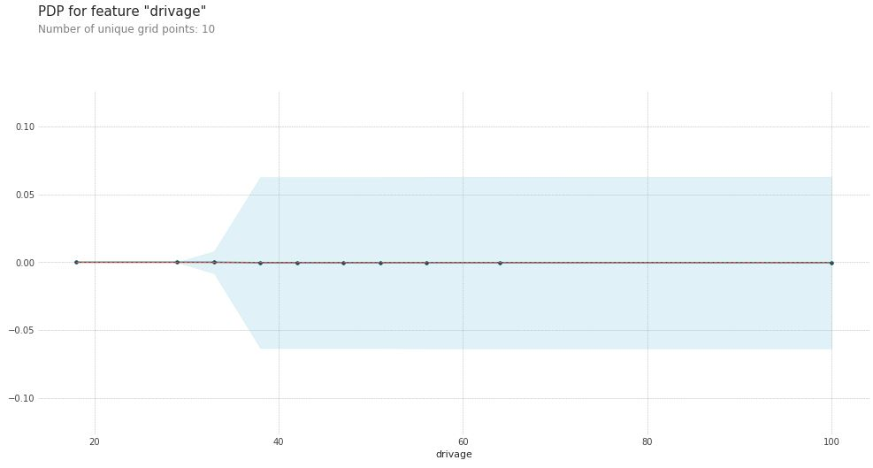
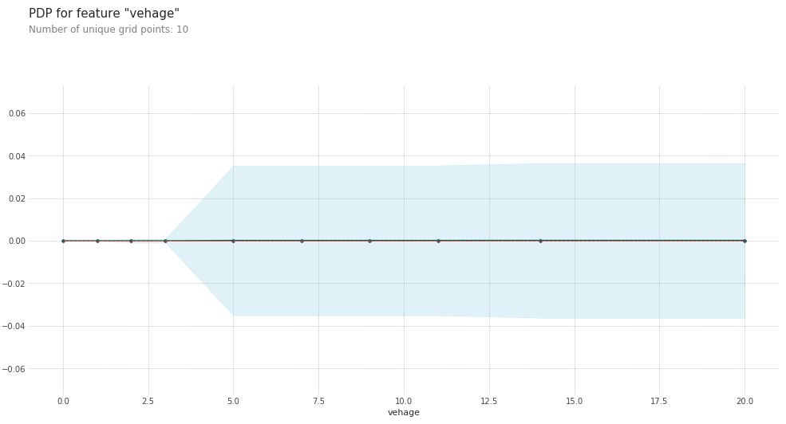
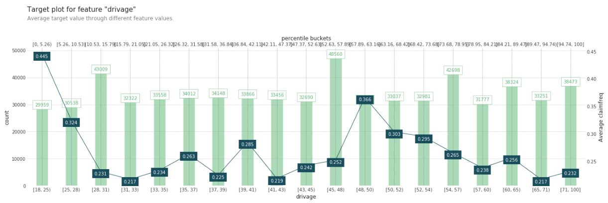
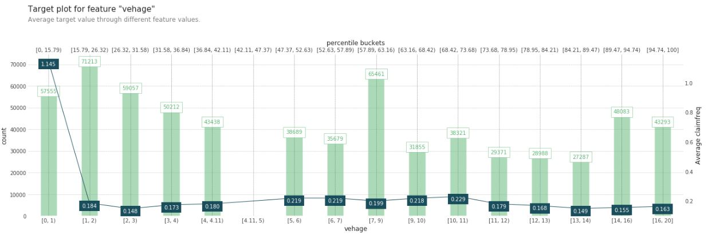
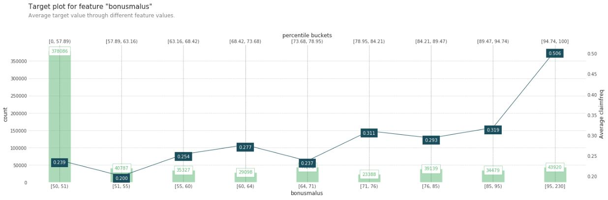

# Partial Dependence Plots (PDP) with Autoinsurance Data

---

### Objective 

With the autoinsurance data, the project seeks to predict the claim frequency based on other features in the data eg. age of vehicle, age of driver, area etc. For model interpretation, the project will use partial dependence plots (PDP). 

<ins>Partial Dependence Plots (PDP)</ins>

PDP gives the extent of influence to prediction by change of the variable. With PDP, we can check the curve over the variable change (as opposed to just a single value to a variable like in variable importances.

### Data Dictionary 

Below description of the dataset, sourced from [OpenML](https://www.openml.org/d/41214). The dataset comprise 12 risk features for ~677K motor third-party liability policies observed mostly on one year. 

| Feature | Type | Description |
| :-----: | :--: | :---------- |
| IDpol | numeric | unique identifier for each policyholder |
| ClaimNb | numeric | number of claims made by policyholder that is covered by insurance period ie. during exposure period |
| Exposure | numeric | duration of insurance coverage of a given policy in years |
| Area | nominal | type of living area of the drive from rural to large urban |
| VehPower | numeric | strength of the vehicle ordered categorically |
| VehAge | numeric | age of the vehicle |
| DrivAge | numeric | age of the driver |
| BonusMalus | numeric | between 50 and 350. <100 means bonus while >100 means malus |
| VehBrand | nominal | 11 categorical classes of vehicle brands |
| VehGas | string | Regular or Diesel |
| Density | numeric | population density per km square, ranging from 0 to 27K |
| Region | nominal | policy regions |

### Findings

<ins>Feature Engineering</ins>

Claim frequency is computed by taking the number of claims (`ClaimNb`) divided by the exposure (`Exposure`) and this will be the target variable for prediction. 

<ins>Modelling and Interpretation</ins>

Random Forest Regressor is used to predict claim frequency, with a cross validated R2 score of 0.987.

*Figure 1: PDP for Driver's Age*

Shows at beyond age 30 there is an increase in contribution towards claim frequency by about 0.05.

*Figure 1: PDP for Vehicle Age*

Shows that for vehicles more than 3 years contribute towards the claim frequency.

*Figure 2: Information plot for Driver's Age*

Higher average claim frequency for drivers aged 18 to 25 and aged 48 to 50. Within reasonable intuition considering that younger drivers are more accident prone due to lack of driving experience. Whereas those in the 48 to 50 range, are from accidents perhaps sue to old age. After 50 years, the average claim frequency has reduced, likely because at this age, not many would be driving. 

*Figure 3: Information plot for Vehicle's Age*

Newers vehicles have much higher average claim frequency than older vehicles. 

*Figure 4: Information plot for Bonus Malus*

### References

*Importance of explainability of models*
https://towardsdatascience.com/three-model-explanability-methods-every-data-scientist-should-know-c332bdfd8df

*Address blackboxes in machine learning*
https://towardsdatascience.com/addressing-the-issue-of-black-boxes-in-machine-learning-f86429acbb2a
